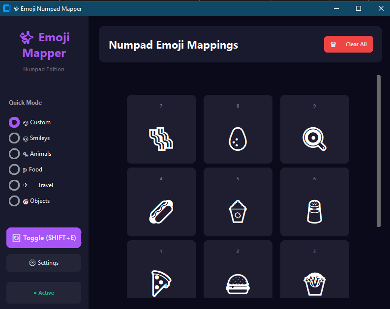
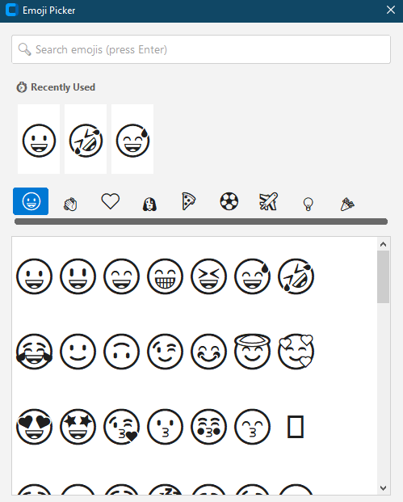

<div align="center">


# ✨ EmojiPad 

**The Ultimate Typing Accelerator for Windows**

*Transform your numeric keypad into a blazing-fast, customizable emoji engine.*

[](https://github.com/HuzaifaCodes/emojipad/actions/workflows/build.yml)
[](https://opensource.org/licenses/MIT)
[](https://www.python.org/)
[](https://www.microsoft.com/windows)

---

**EmojiPad** is a premium, lightweight Windows utility designed for professionals, creators, and power users. By seamlessly intercepting your numpad inputs at the system level, EmojiPad allows you to inject your most-used emojis instantly—without breaking your typing flow. 🚀

[Download Latest Release](#-installation) • [Features](#-features) • [Documentation](#-documentation) • [Contributing](#-contributing)

</div>

---

## 🎯 Why EmojiPad?

In today's digital communication, emojis are essential. But searching for them disrupts your workflow. EmojiPad solves this by turning your unused numpad into a dedicated, context-aware emoji soundboard.

### 🔥 Premium Features
- **⚡ Zero-Latency Injection** - Types emojis instantly at your cursor location using low-level Windows hooks.
- **🔄 Dynamic Profiles** - Instantly switch between custom datasets (Smileys, Tech, Food, Custom) without touching your mouse.
- **🎨 State-of-the-Art UI** - A gorgeous, dark-mode native dashboard powered by CustomTkinter, featuring fluid animations and a modern gradient design.
- **🥷 Stealth Mode** - Runs invisibly in your system tray, consuming less than 50MB of memory.
- **⚙️ Uncompromising Customization** - Fully programmable mappings with a powerful built-in emoji search engine (+1000 emojis).
- **💾 Local First** - Your data never leaves your machine. 100% offline and secure.

---

## 📸 Interface Walkthrough

<div align="center">
  
  
</div>

---

## 🚀 Installation & Usage

### The One-Click Installer
1. Navigate to the [Releases Page](https://github.com/HuzaifaCodes/emojipad/releases).
2. Download `EmojiPad_Setup.exe` (or the portable `EmojiPad.exe`).
3. Run the application. It will automatically nestle into your System Tray.

### How to use it:
1. Hit **`Shift+E`** from *anywhere* in Windows to instantly toggle Emoji Mode.
2. Tap a Numpad key (`0-9`, `+`, `-`, `*`, `/`) to shoot an emoji directly into your active text field.
3. Hit **`Shift+E`** again to seamlessly return your numpad to normal number entry.

---

## 🏗️ Enterprise-Grade Architecture

EmojiPad is built on a scalable, modular Python architecture, utilizing a proper package structure (`src/emojipad`) to ensure maintainability and testability.

### Automated CI/CD Pipeline
Every push and tag is watched by **GitHub Actions**. Our pipeline automatically compiles the standalone `.exe` using PyInstaller and distributes it directly to GitHub Releases, ensuring you always have access to the absolute latest stable build.

### Building from Source

For developers looking to extend EmojiPad or build it locally:

```bash
# 1. Clone the repository
git clone https://github.com/HuzaifaCodes/emojipad.git
cd emojipad

# 2. Use the included Makefile to install dependencies
make install

# 3. Run the application in development mode
make run

# 4. Compile the production executable (outputs to dist/EmojiPad.exe)
make build
```

---

## 📁 Repository Structure

```text
emojipad/
├── src/emojipad/              # Core Application Package
│   ├── core/                  # System-level input hooks & data management
│   ├── ui/                    # CustomTkinter dashboard & visual components
│   └── __main__.py            # Application entry point
├── docs/                      # Comprehensive guides & marketing materials
│   ├── marketing/             # SEO, LinkedIn assets, and product copy
│   └── BUILD.md               # Advanced compilation parameters
├── scripts/                   # Auxiliary maintenance scripts
├── .github/workflows/         # Automated release and CI/CD pipelines
├── run.py                     # Developer runtime wrapper
├── Makefile                   # UNIX/Dev workflow commands
└── EmojiPad.spec              # Production PyInstaller configuration
```

---

## 📚 Documentation

Dive deeper into EmojiPad's technical capabilities in our dedicated `docs/` folder:
- [Executable & Build Guide](docs/BUILD.md)
- [Release Management Workflow](docs/RELEASE_GUIDE.md)
- Marketing Assets: [LinkedIn Strategy](docs/marketing/LINKEDIN_VIRAL_POST.md) • [SEO Optimization](docs/marketing/SEO_DESCRIPTIONS.md)

---

## 🤝 Contributing

We are building the future of text-entry acceleration. Contributions, issues, and feature requests are highly welcome! 

1. Fork the Project
2. Create your Feature Branch (`git checkout -b feature/NextGenMapping`)
3. Commit your Changes (`git commit -m 'Add NextGenMapping'`)
4. Push to the Branch (`git push origin feature/NextGenMapping`)
5. Open a Pull Request

---

<div align="center">

### ⭐ If EmojiPad sped up your workflow, please consider starring this repository!

*Engineered for speed, privacy, and expression.*

</div>
